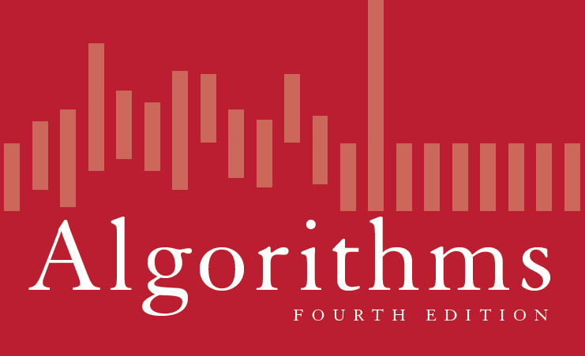

# Algorithms (4th Edition)

:star:《算法（第4版）》的个人学习笔记和部分练习记录 :star:

## 进度
-[ ] Chapter 1: Fundamentals 

-[ ] Chapter 2: Sorting 

-[ ] Chapter 3: Searching 

-[ ] Chapter 4: Graphs  

-[ ] Chapter 5: Strings  

-[ ] Chapter 6: Context

### 链接
[官方网站](https://algs4.cs.princeton.edu/home/)
[官方代码](https://github.com/jimmysuncpt/Algorithms/tree/master/src/edu/princeton/cs/algs4)